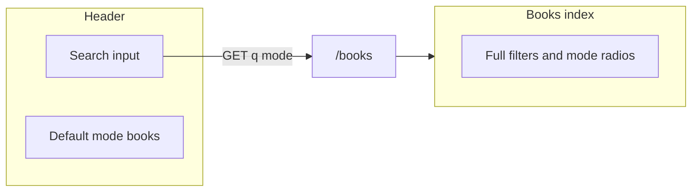

# Global search bar in the UI

## Current state

- Catalog search already lives on [resources/views/books/index.blade.php](resources/views/books/index.blade.php): GET form to `[route('books.index')](routes/web.php)` with `q`, `subject`, `year`, and `mode` (Books vs Author), backed by [BookDiscoveryService](app/Services/Books/BookDiscoveryService.php).
- [resources/views/partials/guest-header.blade.php](resources/views/partials/guest-header.blade.php) only has tab links (Home / Books / Collections); no search field.
- [resources/views/layouts/app/header.blade.php](resources/views/layouts/app/header.blade.php) (Flux) still has a Search navbar item with `href="#"` (dead link).

## Goal

Give users a **compact search bar in the header** on every page that uses the **same** URL contract as the books page, so behavior stays one place: DB-first, OL fallback, persistence, rate limits—all unchanged.

## Recommended behavior

- **Submit target:** `GET {{ route('books.index') }}` with `q` (required for submit; allow empty only if you add a “Browse all” affordance—default is require non-empty before submit or use Books link for browse).
- **Default mode:** `mode=books` (hidden input), so header search matches “book-oriented” intent; users who want Author mode use the full form on `/books` or you add a tiny Books/Author toggle in the header later.
- **Preserve UX:** After search, the books page shows the full filter row; `q` and `mode` remain in the query string so pagination and “Clear filters” keep working.

## Implementation steps

### 1. Guest-facing header ([guest-header.blade.php](resources/views/partials/guest-header.blade.php))

- Add a horizontal block (e.g. under the logo row or inline on `lg+`) containing:
  - `<form method="get" action="{{ route('books.index') }}">`
  - Hidden `<input name="mode" value="books">` (or optional segmented control if you want parity with books page without leaving the page).
  - `<input type="search" name="q" value="{{ request('q') }}" …>` when `request()->routeIs('books.*')`, else empty—so returning from books preserves the query in-header when on that route only, or always read `request('q')` for consistency on any page.
  - Submit button or icon; optional `autocomplete="off"`.
- Tailwind: match existing zinc palette and tap targets; `max-w-md` on large screens so tabs stay usable on mobile (stack search below tabs if needed).

### 2. Authenticated app layout ([layouts/app/header.blade.php](resources/views/layouts/app/header.blade.php))

- Replace the `href="#"` Search item with either:
  - **A.** `href="{{ route('books.index') }}"` + optional `q` in query if missing, or  
  - **B.** A compact Flux-friendly form (if Flux exposes an inline search pattern you already use elsewhere; otherwise link to `/books` is enough for v1).

Prefer **A** or a minimal `<form>` in the navbar slot if layout allows, to mirror guest behavior.

### 3. Accessibility and i18n

- Visible label or `aria-label` on the search field (e.g. “Search books”).
- Submit control has accessible name (“Search”).

### 4. Tests ([tests/Feature/BooksIndexTest.php](tests/Feature/BooksIndexTest.php) or new feature test)

- **Smoke:** From a page that includes the guest header (e.g. `route('home')`), assert the search form `action` is `books.index` and contains `name="q"` and `name="mode"`.
- **Integration:** POST is not used; `GET` with `q` + `mode` hits existing discovery tests—optional one test that `GET /` contains the form pointing to books.

### 5. Out of scope (unless you want parity)

- Duplicating Books/Author radios in the header: optional follow-up; default `mode=books` keeps the first version simple.
- Live Livewire typeahead: not required; server round-trip to `/books` is enough.

## Files to touch

| Area                        | File                                                                                                            |
| --------------------------- | --------------------------------------------------------------------------------------------------------------- |
| Guest nav + search form     | [resources/views/partials/guest-header.blade.php](resources/views/partials/guest-header.blade.php)              |
| App layout search link/form | [resources/views/layouts/app/header.blade.php](resources/views/layouts/app/header.blade.php)                    |
| Tests                       | [tests/Feature/BooksIndexTest.php](tests/Feature/BooksIndexTest.php) or `tests/Feature/GlobalSearchBarTest.php` |

No PHP controller changes are required if the form only forwards `q` and `mode` to existing [BookController::index](app/Http/Controllers/BookController.php) + [BookIndexRequest](app/Http/Requests/BookIndexRequest.php).