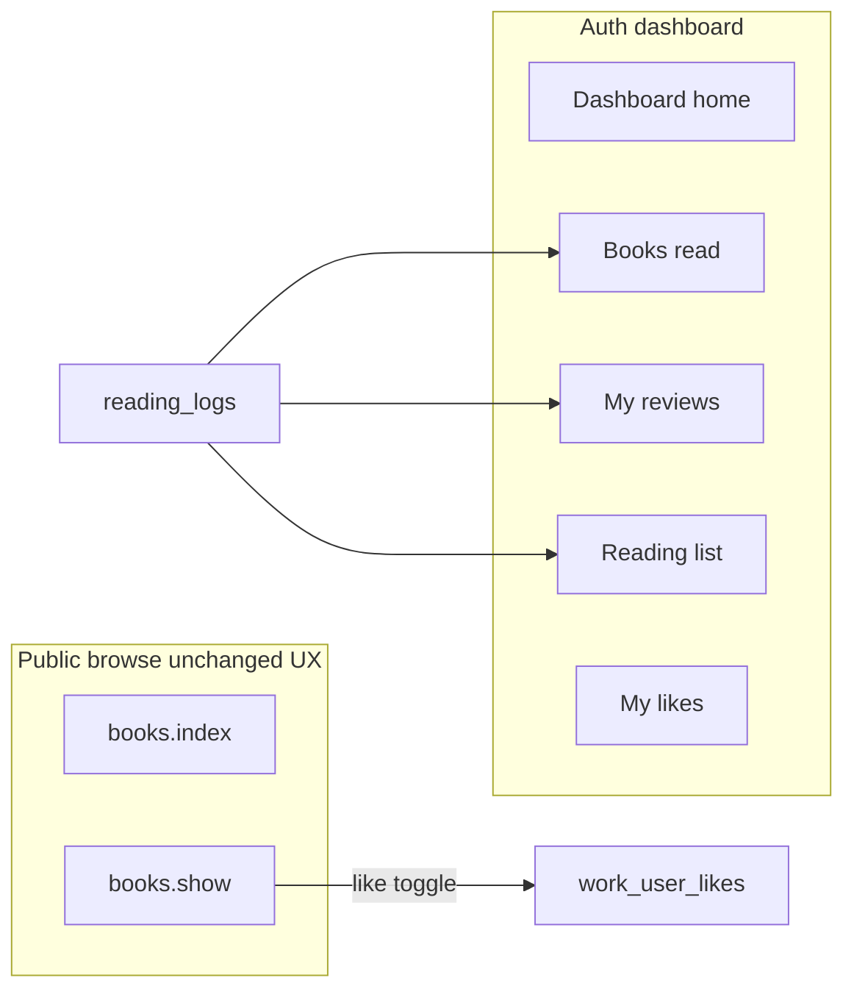

# Authenticated browsing + user dashboard plan

## Current baseline ( facts from the repo )

- **Catalog:** [`Work`](app/Models/Work.php) + routes [`books.index` / `books.show`](routes/web.php) via [`BookController`](app/Http/Controllers/BookController.php). List/show use full-page Blade with [`partials.guest-header`](resources/views/books/index.blade.php)—not the Flux sidebar used in settings.
- **User:** [`users.username`](database/migrations/0001_01_01_000000_create_users_table.php) exists (unique, nullable). [`CreateNewUser`](app/Actions/Fortify/CreateNewUser.php) and [`register.blade.php`](resources/views/pages/auth/register.blade.php) only set `name`, `email`, `password`. Fortify login remains email-based ([`config/fortify.php`](config/fortify.php) `username` => `email`).
- **Activity:** [`ReadingLog`](app/Models/ReadingLog.php) ties `user_id` + `work_id` with `status` values used in factories: `want_to_read`, `currently_reading`, `finished`; optional `review_text`, `rating`, privacy flags. This **already** supports “books read”, “reading list” (TBR), and “currently reading” without a new shelf table—unless you want a separate wishlist unrelated to `ReadingLog`.
- **Reviews on show:** [`BookController::show`](app/Http/Controllers/BookController.php) loads **public** logs with review text; [`books/show.blade.php`](resources/views/books/show.blade.php) renders them. No **likes** feature exists yet.
- **Dashboard route:** [`Route::redirect('/dashboard', '/')`](routes/web.php) today—needs a real destination once dashboard exists.

---

## Product shape

- **Browsing:** Same grids, filters, and book detail layout for everyone. For authenticated users, enhance **only** the chrome (header): account menu, link to dashboard, maybe subtle “logged in as @username”—no change to core browse layout unless you later add per-user affordances (e.g. “Add to list” on cards).
- **Dashboard:** A dedicated area (Flux sidebar + main is consistent with [`resources/views/layouts/app.blade.php`](resources/views/layouts/app.blade.php) / settings) with:
  - **Home:** Greeting + `@username`, quick stats or shortcuts.
  - **Books (read):** `ReadingLog` where `status = finished` (optionally require `date_finished` if you want stricter rules).
  - **Reviews:** Current user’s logs where `review_text` is not empty (respect `is_private`: show all to user; only public ones contribute to book pages—already aligned with controller).
  - **Reading list:** Recommend `status = want_to_read` as primary “list”; optionally a second tab or filter for `currently_reading`.
  - **Likes:** New persistence (see below)—list of liked works, independent of read status unless you choose to sync them later.

---

## Phase 1 — Username at account creation

- **Validation:** `username` required on register (or optional with auto-generation from name—your call; you asked for “pick a username”). Rules: `unique:users,username`, format (e.g. alphanumeric + underscore), length, **reserved slugs** (`admin`, `api`, `settings`, etc.), normalization (store lowercase).
- **Wire-up:** Extend [`ProfileValidationRules`](app/Concerns/ProfileValidationRules.php) or a dedicated `RegisterUserRequest`-style rules array; update [`CreateNewUser`](app/Actions/Fortify/CreateNewUser.php); add field to [`register.blade.php`](resources/views/pages/auth/register.blade.php).
- **Tests:** Extend [`RegistrationTest`](tests/Feature/Auth/RegistrationTest.php) for happy path + uniqueness + format failures.
- **Profile (optional but recommended):** Allow username change in settings Livewire profile with same uniqueness rules, or read-only after signup—decide in a small follow-up.

---

## Phase 2 — Unified browse chrome (auth vs guest)

- **Goal:** Authenticated users see the **same** book index/show content; **header** differs.
- **Approach:** Evolve [`partials.guest-header`](resources/views/partials/guest-header.blade.php) into a shared `site-header` (or `@auth` branches inside the partial) so logged-in users get Profile/Dashboard/Logout without duplicating book templates.
- **Fortify redirects:** Ensure post-login redirect can go to `intended` URL or dashboard—[`FortifyServiceProvider`](app/Providers/FortifyServiceProvider.php) / Fortify config as needed.
- **Tests:** Smoke test: guest vs authenticated GET `books.index` / `books.show` both 200; optional assertion on header snippet if you use `assertSee`.

---

## Phase 3 — Dashboard routes, layout, and pages

- **Routes:** Under `auth` + `verified` middleware as appropriate (match existing settings). Example structure:
  - `GET /dashboard` — overview
  - `GET /dashboard/books` — finished
  - `GET /dashboard/reviews` — my reviews
  - `GET /dashboard/reading-list` — want to read (+ optional current)
  - `GET /dashboard/likes` — liked works  
  Replace the current [`/dashboard` redirect](routes/web.php) with a real controller or invokable + named routes.
- **Implementation style:** Prefer a small [`DashboardController`](app/Http/Controllers/) with methods, or dedicated controllers per section—follow whatever is most consistent with [`BookController`](app/Http/Controllers/BookController.php). Use **pagination** and **eager load** `work.authors` / cover relations to avoid N+1 (Laravel best practices).
- **UI:** Reuse Flux patterns from settings; keep visual language consistent with browse (tokens, typography) inside the main panel.
- **Tests:** Feature tests per route: empty state + seeded `ReadingLog`/`Like` rows (factories).

---

## Phase 4 — Likes (data model + book show)

- **Schema:** New table e.g. `work_likes` with `user_id`, `work_id`, timestamps, **unique** `(user_id, work_id)`; FK to `users` and `works`.
- **Model:** `WorkLike` or `UserWorkLike` with relations on [`User`](app/Models/User.php) and [`Work`](app/Models/Work.php); consider `likedWorks()` on `User` for the dashboard page.
- **Book show UI:** In [`books/show.blade.php`](resources/views/books/show.blade.php), add a like control **only for `@auth`** (heart/icon + label). Implementation options:
  - **Minimal:** Livewire island on the show page (fits Livewire 4 + Flux stack).
  - **Alternative:** Form POST to a `WorkLikeController@toggle` with CSRF—simpler but full page reload unless paired with Volt/Alpine.
- **Public signal (optional later):** Aggregate like counts on show page; not required for MVP dashboard list.
- **Tests:** Toggle creates/destroys row; guest cannot POST; dashboard lists liked works.

---

## Phase 5 — Connecting dashboard sections to real workflows (incremental)

Right now users may have **no UI** to create `ReadingLog` rows from the site (verify in codebase when you start Phase 3). The dashboard will be empty until you add at least one of:

- **“Add to reading list” / “Mark as read”** on [`books.show`](resources/views/books/show.blade.php) (and optionally on cards), or
- An import/migration path for historical data.

Schedule this as **Phase 5a** so Phase 3 delivers pages with empty states + tests using factories, then 5a wires book pages to `ReadingLog` CRUD.

---

## Decisions to lock before coding (small)

| Topic | Default recommendation |
|--------|-------------------------|
| Reading list scope | `want_to_read` only; `currently_reading` as filter/tab |
| Username vs `@handle` in UI | Show `@username` in dashboard; keep `name` for display elsewhere |
| Likes vs stars | Separate “like” from `rating` on `ReadingLog` |

---

## Suggested breakdown into PR-sized chunks

1. Username registration + tests  
2. Shared header for auth on browse pages + tests  
3. Dashboard shell + overview only (Flux layout, `@username`)  
4. Dashboard CRUD pages for logs (read / reading list / reviews) with pagination—**may depend on 5a** for end-to-end UX  
5. `work_likes` migration + model + show-page toggle + dashboard likes + tests  
6. Book show + index actions to create/update `ReadingLog` (so dashboard fills with real usage)

This order minimizes rework: auth identity first, then navigation, then data features, then likes, then log entry points if missing.
