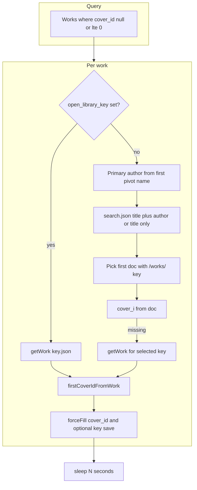

# Work cover enrichment from Open Library

## Goal

Goodbooks bootstrap leaves `[Work::$cover_id](app/Models/Work.php)` null; `[cover_url](app/Models/Work.php)` is derived from `cover_id` via `[OpenLibraryBookNormalizer::coverUrlFromCoverId](app/Services/OpenLibrary/OpenLibraryBookNormalizer.php)`. This feature bulk-fills `cover_id` using OL’s CDN (`covers.openlibrary.org`) after conservative API usage (sleep between attempts).

## Design constraints

- **Do not** call `[OpenLibraryWorkSyncService::syncFromWorkKey](app/Services/OpenLibrary/OpenLibraryWorkSyncService.php)` for enrichment: it **re-syncs authors** and would overwrite Goodbooks `[author_works](app/Services/Books/GoodbooksBootstrapService.php)` links.
- **Update only** `cover_id`, and set `open_library_key` when it is currently null (helps later OL/dump alignment). No other columns required for MVP.

## Data flow

## Implementation steps

### 1. Normalizer helpers

In `[app/Services/OpenLibrary/OpenLibraryBookNormalizer.php](app/Services/OpenLibrary/OpenLibraryBookNormalizer.php)`:

- Add `**firstCoverIdFromSearchDoc(array $doc): ?int**` from `cover_i` (same rules as current `[coverUrlFromSearchDoc](app/Services/OpenLibrary/OpenLibraryBookNormalizer.php)`).
- Add `**workKeyFromSearchDoc(array $doc): ?string**` — require `key` string starting with `/works/` (mirror `[FeaturedBooksImporter::resolveWorkKey](app/Services/Books/FeaturedBooksImporter.php)`).
- Refactor `**coverUrlFromSearchDoc**` to delegate to `firstCoverIdFromSearchDoc` + `coverUrlFromCoverId` (no behavior change).

### 2. Open Library HTTP client

In `[app/Services/OpenLibrary/OpenLibraryService.php](app/Services/OpenLibrary/OpenLibraryService.php)`:

- Add `**searchDocumentsByTitle(string $title, int $limit = 10)**` calling `search.json` with `title` only (for works with no authors).
- Deduplicate `**searchDocumentsByTitleAndAuthor**` and title-only search via a small **private `normalizeSearchDocs`** that extracts `docs` into a `Collection` (same shape as today).

Existing `**getWork**`](app/Services/OpenLibrary/OpenLibraryService.php)** already supports fetching work JSON for `[firstCoverIdFromWork](app/Services/OpenLibrary/OpenLibraryBookNormalizer.php)`.

### 3. Enrichment service

New `**app/Services/Books/WorkCoverEnrichmentService.php`**:

- `**enrichBatch(?int $limit, ?int $sleepSeconds): array{processed, enriched, skipped}`** — load batch with `Work::query()->with('authors')->whereNull('cover_id')->orWhere('cover_id','<=',0)->orderBy('id')->limit(...)`.
- **Per work:**
  - If `**open_library_key`** present: `getWork` + `firstCoverIdFromWork`; save `cover_id` if found.
  - Else: derive **primary author** as trimmed segment before first comma of the first pivot author name (same ordering as Goodbooks); if empty, **title-only** search.
  - Iterate search docs, pick **first** where `workKeyFromSearchDoc` non-null.
  - `cover_id` = `firstCoverIdFromSearchDoc`; if still null, `**getWork`** on that key and `firstCoverIdFromWork`.
  - If `open_library_key` empty and key known, set `**open_library_key`** using `[OpenLibraryWorkSyncService::normalizeWorkKey](app/Services/OpenLibrary/OpenLibraryWorkSyncService.php)`.
- `**sleep($sleepSeconds)` once per work** after each enrichment attempt (keeps aggregate rate low even when search + getWork = 2 calls).

### 4. Config

Extend `[config/books.php](config/books.php)` with `**enrich_covers`**: e.g. `sleep_seconds_between_requests` (default `12` ~5/min per work) and `batch_limit_per_job` (default `25`), overridable via env vars.

### 5. Job and Artisan command

- `**app/Jobs/EnrichWorkCoversJob.php`** — `ShouldQueue`, reads limits/sleep from config, calls `WorkCoverEnrichmentService::enrichBatch()`, sensible `$tries`.
- `**app/Console/Commands/...**` e.g. `works:enrich-covers` with `--limit`, `--sleep`, `**--sync**` to run service in-process vs `$this->job()` dispatch.

Document in `[AGENTS.md](AGENTS.md)` DigitalOcean bullet: production needs a **queue worker** if not using `--sync`.

### 6. Scheduling (optional follow-up)

In `[bootstrap/app.php](bootstrap/app.php)` `withSchedule`, optionally dispatch the job **daily** (or weekly) so enrichment continues in small batches—only after validating rate limits against [OL API expectations](https://openlibrary.org/dev/docs/api).

### 7. Tests (Pest)

- **Unit:** `firstCoverIdFromSearchDoc` / `workKeyFromSearchDoc` (and `coverUrlFromSearchDoc` still matches prior expectations).
- **Feature:** `Http::fake` sequence for `search.json` + optional `/works/...json`; seed a `Work` with authors + null `cover_id`; run command `--sync`; assert `cover_id` and optionally `open_library_key` set.

Run `vendor/bin/pint --dirty` on touched PHP files.

## Risks / product notes

- **Wrong match:** first search hit can mis-associate covers; acceptable for MVP; later: scoring, manual review flags, or `edition_key` from search docs.
- **Rate limits:** env-tunable sleep; do not run huge batches without worker timeouts configured on App Platform.

