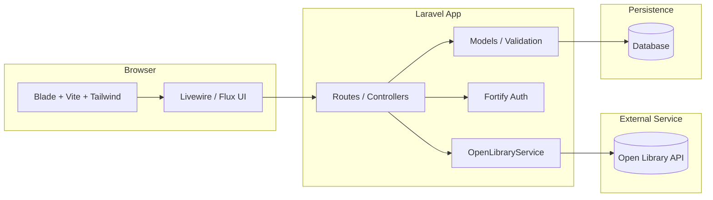
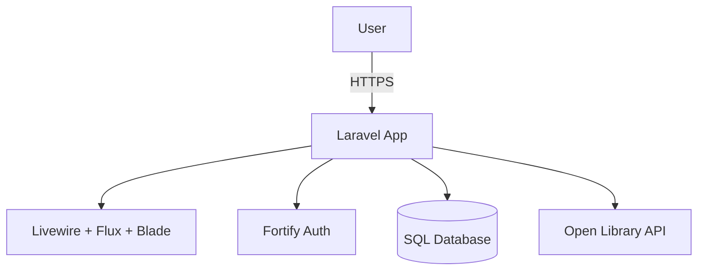

# Signitur

Signitur is a social reading tracker built for readers who want to search for books, log what they are reading, write reviews, follow friends, and see reading activity in one place.

This project uses **Laravel 13**, **Livewire 4**, **Flux UI**, **Fortify**, **Tailwind CSS 4**, **Vite**, and the **Open Library API**.

## Project Purpose And Goals

| Area             | Summary                                                                                                                                      |
| ---------------- | -------------------------------------------------------------------------------------------------------------------------------------------- |
| Problem          | Reading progress, reviews, and friend activity are often scattered across different apps or not tracked at all.                              |
| Purpose          | Give users one place to discover books, keep personal reading logs, and interact with other readers.                                         |
| Success Criteria | A smooth book search flow, reliable reading logs, useful privacy/review options, and a simple social layer without overcomplicating the app. |

### Initial Goals

- Search books and store local metadata in `books` using `open_library_id`.
- Support one reading log per user per book with status, dates, rating, review text, spoiler flag, and privacy flag.
- Let users follow each other and generate activity entries for key actions.
- Provide an authenticated dashboard and polished UI with Livewire and Flux.

## Data Model

The current schema includes `books`, `reading_logs`, `users`, `follows`, and `activities`. Foreign keys live on `reading_logs` (`user_id`, `book_id`) and `activities` (`user_id`), while `follows` connects two rows in `users`.

## System Design

This diagram shows the main technologies used by the app and how requests move between the UI, Laravel backend, database, and Open Library.

## Architecture Overview

This is the simplest view of the system: a user interacts with the Laravel application, which renders the UI, handles authentication, stores data, and fetches external book information.

## What I learned

I learned about how to start and setup a laravel project. I learned more about middleware, creating APIs, setting up databases. I learned that book databases are more complicated than i had initially realized.

I had initially setup my project to be built on OpenLibrary's api, but I quickly realized that, were I to serve real traffic, I would hit their API rate limit very quickly and would possibly get shutdown. This is only a school project but I wanted to treat it as if I were building this for a real company, so I had to come up with a better plan. I found a "seeder" file that I downloaded with 10,000 of the more popular books, and used those as a base to seed my database. I figured that as long as I wasn't constantly hitting their API with new users all the time I would use their API to "enrich" the books that I already had in my database. So when a user would search my books I would first search my postgres database, then if the book wasnt enriched i would enrich it with the OL api and serve that to users. I basically cached API calls in my database.

I had plans to build really good search with my API, to integrate in vector search with postgres, but I ran out of time. So no AI integration. I used AI to do all of the coding, only directing it how i wanted things implemented and how the frontend to look.

I really enjoy using the Letterboxd app, I think its a fun take on social media, and they are very focused only on movies and their audience. I enjoy reading and wanted to try to build something similar to Letterboxd but for books. I'm also currently working in a laravel project for my job so I wanted to work on those skills as well.

## Failover, Scaling, Performance, Authentication, and Concurrency

The system is designed to stay available by using health checks and automatic failover to a standby instance if the primary service becomes unavailable. It scales horizontally by running multiple app instances behind a load balancer, while performance is improved through caching, indexed database queries, and asynchronous background jobs for heavy tasks. Authentication is handled securely with token-based sessions and role-based access control. Concurrency is managed with database transactions, optimistic locking where needed, and queued workers to prevent race conditions during high-traffic operations.

## Schedule Through End Of Class

| Week | Dates         | Focus                                                      |
| ---- | ------------- | ---------------------------------------------------------- |
| 1    | Mar 24-Mar 30 | Project setup, migrations, Open Library search, book model |
| 2    | Mar 31-Apr 6  | Reading log UI, validation, spoiler/private settings       |
| 3    | Apr 7-Apr 13  | Follow system, activity feed, dashboard polish             |
| 4    | Apr 14-End    | Testing, bug fixes, demo prep, README cleanup              |

## Time Log

Track hours spent on the project here.

| Date       | Description                 | Hours    |
| ---------- | --------------------------- | -------- |
| 03/24/2026 | Project research            | 1.0      |
| 03/25/2026 | Project setup and planning  | 3.0      |
| 03/26/2026 | Initial implementation work | 1.0      |
| 03/27/2026 | Backend work                | 3.0      |
| 04/2/2026  | Data/api integration        | 7.0      |
| 04/3/2026  | deploy to digital ocean     | 7.0      |
| 04/04/2026 | backend work/frontend work  | 5.0      |
| 04/05/2026 | frontend rework             | 5.0      |
| 04/06/2026 | class presentation/collaboration | 1.0      |
| 04/12/2026 | Final Presentations on teams | 1.0      |
| 04/14/2026 | teams overview | 1.0      |
|            | **Total**                   | **35.0** |

