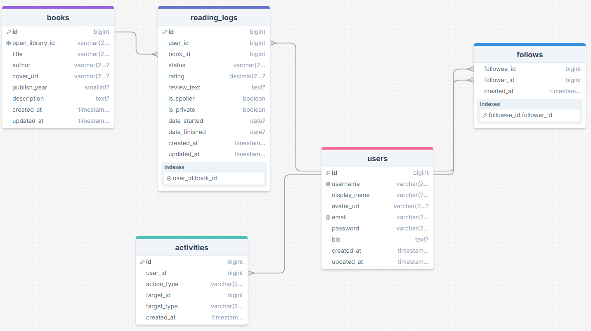
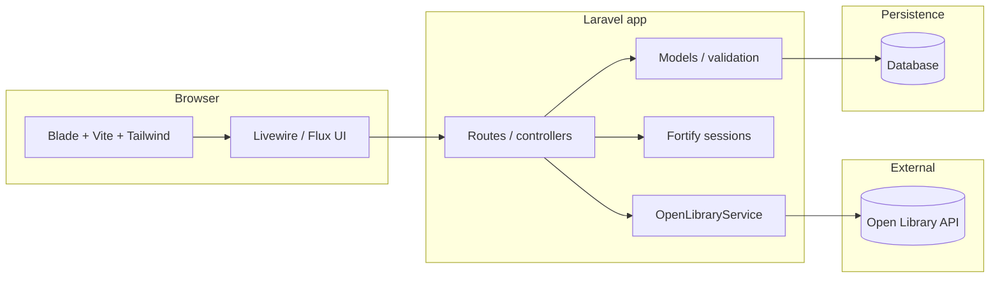
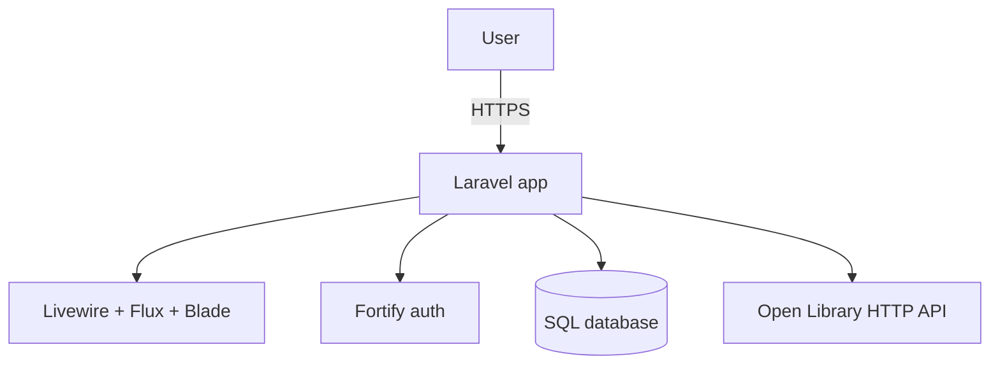

**Signitur** is a social reading tracker: find books (via [Open Library](https://openlibrary.org/)), log what you are reading, rate and review, follow friends, and see an activity feed. The stack is **Laravel 13**, **Livewire 4**, **Flux UI**, **Fortify** (auth), **Tailwind CSS 4**, and **Vite**.
---
## Purpose & goals
| | |
| --- | --- |
| **Problem** | Keeping reading history, reviews, and friend activity in one place is easier when the app is built for readers first. |
| **Purpose** | Let signed-in users track books, share progress and reviews (with privacy controls), follow others, and skim a feed of what the network is doing. |
| **Success** | Reliable search/import from Open Library, clear reading-log UX, and a simple social layer (follows + activities) without scope creep. |
**Goals (initial)**
- [ ] Search books and cache metadata locally (`books` keyed by `open_library_id`).
- [ ] One reading log per user per book with status, dates, rating, review, spoiler/private flags.
- [ ] Follow relationships between users; activity entries for notable actions (polymorphic `activities`).
- [ ] Authenticated dashboard and settings; polish with Flux + Livewire.
*Visuals:* GitHub and many editors render the Mermaid diagrams below as figures. Export a PNG from [Mermaid Live](https://mermaid.live/) if you need a slide or PDF.
---
## Data model (ERD)

Entity-relationship view of the migrated schema (`books`, `reading_logs`, `users`, `follows`, `activities`). Foreign keys live on `reading_logs` (`user_id`, `book_id`) and `activities` (`user_id`); `follows` links two `users` rows.

---
## System design (technologies & interactions)

---
## Architecture (simple)

---
## Schedule toward end of class
Adjust dates to match your syllabus. *End of class* below is a placeholder—replace with your real last day.
| Week | Dates (example) | Focus |
| --- | --- | --- |
| 1 | Mar 24–30 | Environment, migrations, Open Library search, book model |
| 2 | Mar 31–Apr 6 | Reading logs UI, validation, privacy/spoiler rules |
| 3 | Apr 7–13 | Follows, activity feed, dashboard polish |
| 4 | Apr 14–*end* | Tests, bugfix, demo prep, README / screenshots |
**Daily goals (fill in)**
| Date | Goal |
| --- | --- |
| | |
| | |
| | |
| | |
| | |
---
## UX sketches (optional)
Add wireframes here when you have them:
- **Search → book detail → add to log** flow.
- **Dashboard**: feed + “my books” summary.
- Paste images: `` or link to Figma.
*(No sketches in-repo yet—placeholder section.)*
---