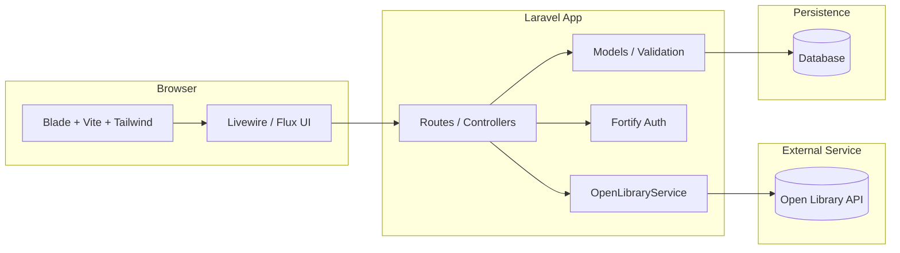
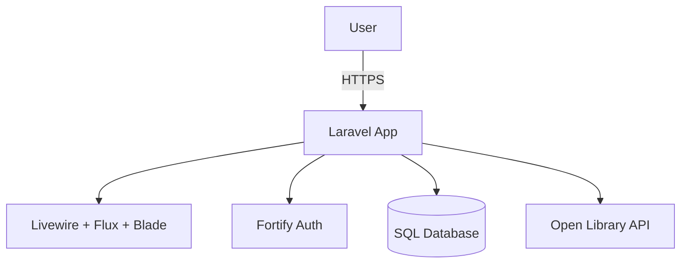

# Signitur

Signitur is a social reading tracker built for readers who want to search for books, log what they are reading, write reviews, follow friends, and see reading activity in one place.

This project uses **Laravel 13**, **Livewire 4**, **Flux UI**, **Fortify**, **Tailwind CSS 4**, **Vite**, and the **Open Library API**.

## Project Purpose And Goals

| Area             | Summary                                                                                                                                      |
| ---------------- | -------------------------------------------------------------------------------------------------------------------------------------------- |
| Problem          | Reading progress, reviews, and friend activity are often scattered across different apps or not tracked at all.                              |
| Purpose          | Give users one place to discover books, keep personal reading logs, and interact with other readers.                                         |
| Success Criteria | A smooth book search flow, reliable reading logs, useful privacy/review options, and a simple social layer without overcomplicating the app. |

### Initial Goals

- Search books and store local metadata in `books` using `open_library_id`.
- Support one reading log per user per book with status, dates, rating, review text, spoiler flag, and privacy flag.
- Let users follow each other and generate activity entries for key actions.
- Provide an authenticated dashboard and polished UI with Livewire and Flux.

## Data Model

The current schema includes `books`, `reading_logs`, `users`, `follows`, and `activities`. Foreign keys live on `reading_logs` (`user_id`, `book_id`) and `activities` (`user_id`), while `follows` connects two rows in `users`.

## System Design

This diagram shows the main technologies used by the app and how requests move between the UI, Laravel backend, database, and Open Library.

## Architecture Overview

This is the simplest view of the system: a user interacts with the Laravel application, which renders the UI, handles authentication, stores data, and fetches external book information.

## Schedule Through End Of Class

| Week | Dates         | Focus                                                      |
| ---- | ------------- | ---------------------------------------------------------- |
| 1    | Mar 24-Mar 30 | Project setup, migrations, Open Library search, book model |
| 2    | Mar 31-Apr 6  | Reading log UI, validation, spoiler/private settings       |
| 3    | Apr 7-Apr 13  | Follow system, activity feed, dashboard polish             |
| 4    | Apr 14-End    | Testing, bug fixes, demo prep, README cleanup              |

## Time Log

Track hours spent on the project here.

| Date       | Description                 | Hours   |
| ---------- | --------------------------- | ------- |
| 03/24/2026 | Project research            | 1.0     |
| 03/25/2026 | Project setup and planning  | 4.0     |
| 03/26/2026 | Initial implementation work | 1.0     |
| 03/27/2026 |                             |         |
|            |                             |         |
|            |                             |         |
|            |                             |         |
|            |                             |         |
|            | **Total**                   | **6.0** |

